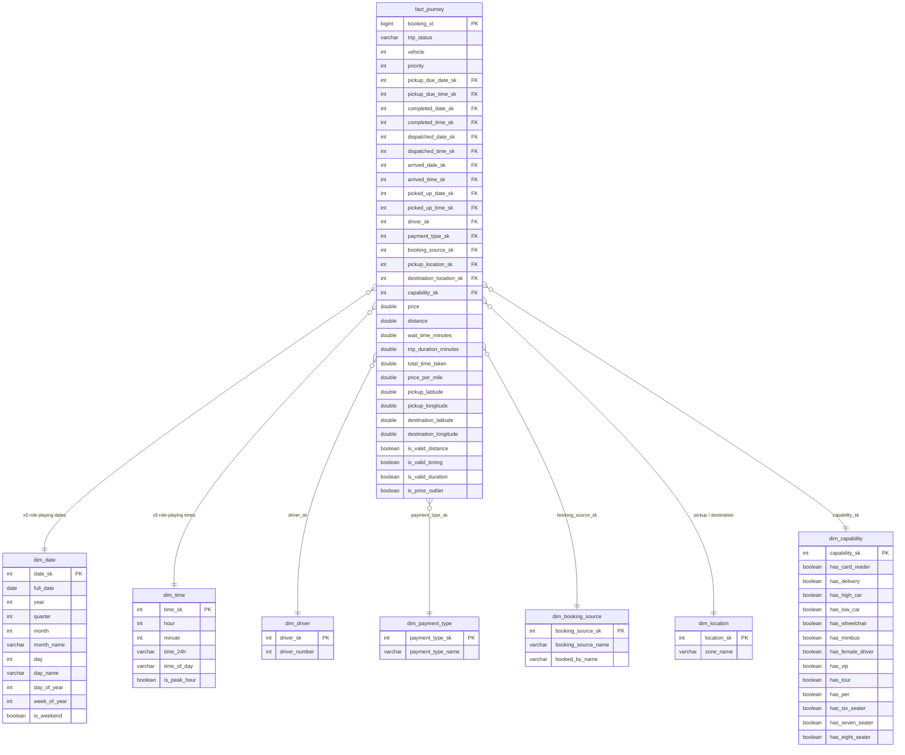

# Taxi Journeys — Kimball Star Schema

A Lakeflow Spark Declarative Pipeline that ingests raw taxi booking data from CSV, cleans and enriches it through a medallion architecture (Bronze → Silver → Gold), and materialises a **Kimball star schema** with seven dimensions and one fact table.

## Pipeline Overview

| Layer | Table | Grain | Notebook |
| --- | --- | --- | --- |
| Bronze | `bronze_taxi_data` | One row per raw CSV record | `01-Bronze-Taxi` |
| Silver | `silver_taxi_data` | One row per `booking_id` (deduplicated) | `02-Silver-Taxi` |
| Gold | `gold_taxi_data` | One row per booking with derived measures | `03-Gold-Taxi` |
| Star — Dims | 7 dimension tables | See schema below | `04a-Dim-Taxi` |
| Star — Fact | `fact_journey` | One row per taxi journey | `04b-Fact-Taxi` |

## Data Source

* **Format:** CSV
* **Location:** `/Volumes/students_data/team-1-data-schema/team-1-data-schema-volume/taxi_data.csv`
* **Catalog / Schema:** `students_data`.`team-1-data-schema`
* **Pipeline name:** `team-1-taxi-service`
* **Geography:** Ireland / UK (destination coordinates filtered to lat 51.4–55.5, lon -10.8 to -5.2)

## Entity-Relationship Diagram

<iframe width="100%" height="400" src="https://dbdiagram.io/e/6aaa4dbfaf7c3b0bd1ef30b2/6aaa54cafe722b4a39057138"></iframe>

> If the interactive diagram above doesn't render, view it directly at [dbdiagram.io](https://dbdiagram.io/e/6aaa4dbfaf7c3b0bd1ef30b2/6aaa54cafe722b4a39057138).

Mermaid ER diagram (code-based fallback)

### Role-Playing Dimensions

`dim_date` and `dim_time` are **role-playing** — each is joined five times for the five event timestamps:

| Event | Date FK | Time FK |
| --- | --- | --- |
| Pickup due | `pickup_due_date_sk` | `pickup_due_time_sk` |
| Completed | `completed_date_sk` | `completed_time_sk` |
| Dispatched | `dispatched_date_sk` | `dispatched_time_sk` |
| Vehicle arrived | `arrived_date_sk` | `arrived_time_sk` |
| Picked up | `picked_up_date_sk` | `picked_up_time_sk` |

`dim_location` is also role-playing, joined once for `pickup_zone` and once for `destination_zone`.

## Transformation Summary

### Bronze

Raw CSV ingestion with column name standardisation (lowercase, underscores) and an `ingestion_timestamp` audit column.

### Silver

* **Deduplication** — `ROW_NUMBER` by `booking_id` keeps only the latest ingested record
* **Type casting** — strings → timestamps, doubles, integers; `driver` `#` prefix stripped; `price` commas removed
* **Capability mapping** — letter codes decoded to readable names via UDF (e.g. `ZM6` → `Card Reader, Minibus, 6 seater`)
* **Payment override** — `payment_type` set to `Card` when vehicle has card-reader capability (`Z`)
* **Filtering** — completed trips below £3.20 minimum fare removed; destination coordinates must be within Ireland/UK bounding box
* **DLT expectations** — 6 data quality rules (non-null booking_id, valid coordinates, non-negative distance, etc.)

### Gold

* **Derived measures** — `wait_time_minutes`, `trip_duration_minutes`, `total_time_taken`, `price_per_mile`
* **Validity flags** — `is_valid_distance`, `is_valid_timing`, `is_valid_duration`, `is_price_outlier` (IQR upper fence: £8.16/mile)
* **Capability booleans** — 13 `has_*` flags decoded from the comma-separated capabilities string

### Star Schema (Dims + Fact)

Surrogate keys generated via `ROW_NUMBER` window functions in each dimension. `fact_journey` joins `gold_taxi_data` to all seven dimensions with left joins, producing a fully-keyed fact table.

## Data Quality

| Expectation | Rule | Action |
| --- | --- | --- |
| `valid_booking_id` | `booking_id IS NOT NULL` | Drop row |
| `valid_pickup_due` | `pickup_due IS NOT NULL` | Warn |
| `valid_coordinates` | pickup lat/lon not null | Warn |
| `non_negative_distance` | `distance >= 0 OR NULL` | Warn |
| `completed_has_arrival_time` | completed → `time_vehicle_arrived` not null | Warn |
| `completed_has_pickup_time` | completed → `time_picked_up` not null | Warn |

## Branch

`team-1-kimball`
